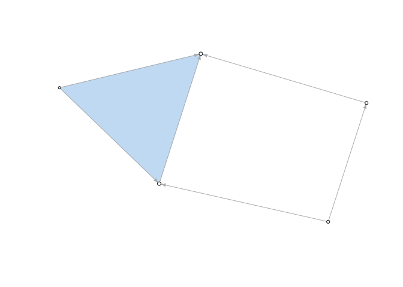

Plot Example
================

#### Create and plot a simple nerve complex from an open cover, then compute the Combinatorial Laplacian score of a hardcoded binary feature

``` r
library(RayleighSelection)
```

Compute the nerve complex of an open cover
------------------------------------------

``` r
gy <- nerve_complex(list(c(1,4,6,10), c(1,2,7), c(2,3,8), c(3,4,9,10), c(4,5)))
```

### Plot nerve complex

``` r
plot_skeleton(gy)
```

    ## [1] "Convergence reached at step 779"



Compute 0-dimensional and 1-dimensional combinatorial Laplacian scores, p-value, and q-value
--------------------------------------------------------------------------------------------

#### For the given binary feature on points

``` r
rayleigh_selection(gy,t(as.data.frame(c(0,1,1,0,0,0,0,0,0,1))))
```

    ##                                        R0    p0    q0        R1   p1   q1
    ## c(0, 1, 1, 0, 0, 0, 0, 0, 0, 1) 0.9584665 0.458 0.458 0.5536398 0.16 0.16
