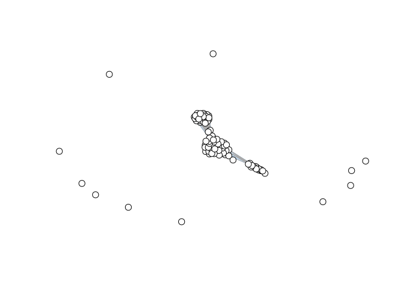

Vietoris-Rips Complex Example
================

#### Calculate the Combinatorial Laplacian score of genes on a VR complex from the first 50 principal components of gene expression data from two cell differentiation paths of mouse embryonic cells

``` r
library(RayleighSelection)
```

## Load data

``` r
expression <- read.table(file = "https://www.dropbox.com/s/3ohj3evv3zwzrs9/filtered_normalized_counts_ordered.csv?dl=1", sep=",", header=TRUE, row.names=1, stringsAsFactors=FALSE)

pca <- read.table("https://www.dropbox.com/s/onmnzlerl56ckq9/pca_50_ordered.csv?dl=1", sep=",", header=TRUE, row.names=1, stringsAsFactors = FALSE)
```

### Subsample data

#### Take a random sample of cells so L1 laplacian runs faster

``` r
# A subsample of 100 cells is loaded below - reduce the number of cells to run faster
# subsample_cells <- sample(nrow(pca), 100, replace=FALSE)
# subsample_cells <- subsample_cells[order(subsample_cells)]

# Use these cells if you want to directly reproduce the R0 and R1 scores below
subsample_cells <- scan(file="https://www.dropbox.com/s/84z0poyz2vhqis8/tutorial_subsample.txt?dl=1", what=numeric())
```

``` r
subsample_pca <- pca[subsample_cells,]
subsample_expression <- expression[,subsample_cells]

# Take only genes that occur in >5% and <50% of cells
subsample_expression <- subsample_expression[rowSums(subsample_expression != 0)>5,]
subsample_expression <- subsample_expression[rowSums(subsample_expression != 0)<50,]
```

## Create Euclidean distance matrix from principal components

``` r
distance_matrix <- as.matrix(dist(subsample_pca, method="euclidean"))
```

# Only 0-form Combinatorial Laplacian score

## Create the 1-skeleton of a Vietoris-Rips complex from the distance matrix

#### With radius=28

``` r
gg <- vr_complex(distance_matrix, 28, clique = FALSE)
```

### Show Vietoris-Rips complex

``` r
plot_skeleton(gg)
```

<!-- -->

## Compute 0-form Comb. Lap. score, p-value, and q-value

#### For all genes in the expression matrix

#### Only use 1-skeleton for 0th Comb. Lap. score

``` r
scoresR0 <- rayleigh_selection(gg, subsample_expression, num_perms = 1000, num_cores = 8, one_forms = FALSE)
(scoresR0[order(scoresR0$R0),])[1:5,]
```

    ##               R0 p0 q0
    ## Ptgfrn 0.2495856  0  0
    ## Hspa8  0.2538195  0  0
    ## Rps3a3 0.2587549  0  0
    ## Muc6   0.2820250  0  0
    ## Gm5575 0.2938021  0  0

# Both 0-form and 1-form Combinatorial Laplacian score

## Create the Vietoris-Rips complex from the distance matrix on first 20 cells

#### Including higher-order relations

#### With radius=28

``` r
gg <- vr_complex(distance_matrix, 28)
```

### Show Vietoris-Rips complex

``` r
plot_skeleton(gg)
```

<!-- -->

## Compute 0-form and 1-form Comb. Lap. scores, p-value, and q-value

#### For all genes in the expression matrix

This will take around 1 hour to run. Decrease the number of cells to run
faster.

``` r
scores <- rayleigh_selection(gg, subsample_expression, num_perms = 1000, num_cores = 8, one_forms = TRUE)
```

    ## Warning in any(x@x, ..., na.rm = na.rm): coercing argument of type 'double' to
    ## logical

    ## Warning in any(x@x, ..., na.rm = na.rm): coercing argument of type 'double' to
    ## logical

    ## Warning in any(x@x, ..., na.rm = na.rm): coercing argument of type 'double' to
    ## logical

    ## Warning in any(x@x, ..., na.rm = na.rm): coercing argument of type 'double' to
    ## logical

    ## Warning in any(x@x, ..., na.rm = na.rm): coercing argument of type 'double' to
    ## logical

    ## Warning in any(x@x, ..., na.rm = na.rm): coercing argument of type 'double' to
    ## logical

    ## Warning in any(x@x, ..., na.rm = na.rm): coercing argument of type 'double' to
    ## logical

    ## Warning in any(x@x, ..., na.rm = na.rm): coercing argument of type 'double' to
    ## logical

    ## Warning in any(x@x, ..., na.rm = na.rm): coercing argument of type 'double' to
    ## logical

    ## Warning in any(x@x, ..., na.rm = na.rm): coercing argument of type 'double' to
    ## logical

    ## Warning in any(x@x, ..., na.rm = na.rm): coercing argument of type 'double' to
    ## logical

    ## Warning in any(x@x, ..., na.rm = na.rm): coercing argument of type 'double' to
    ## logical

    ## Warning in any(x@x, ..., na.rm = na.rm): coercing argument of type 'double' to
    ## logical

    ## Warning in any(x@x, ..., na.rm = na.rm): coercing argument of type 'double' to
    ## logical

    ## Warning in any(x@x, ..., na.rm = na.rm): coercing argument of type 'double' to
    ## logical

    ## Warning in any(x@x, ..., na.rm = na.rm): coercing argument of type 'double' to
    ## logical

    ## Warning in any(x@x, ..., na.rm = na.rm): coercing argument of type 'double' to
    ## logical

    ## Warning in any(x@x, ..., na.rm = na.rm): coercing argument of type 'double' to
    ## logical

    ## Warning in any(x@x, ..., na.rm = na.rm): coercing argument of type 'double' to
    ## logical

``` r
(scores[order(scores$R1, scores$R0),])[1:5,]
```

    ##               R0    p0        q0       R1    p1        q1
    ## Osbpl2 1.0082917 0.274 0.4717023 1.423183 0.003 0.2978788
    ## Nrxn3  0.9713071 0.017 0.0690252 1.771032 0.016 0.4839385
    ## Scn3b  0.8536292 0.000 0.0000000 1.810641 0.000 0.0000000
    ## Ptk2b  1.0106767 0.350 0.5453321 1.900330 0.053 0.5675272
    ## Foxj2  1.0020631 0.069 0.1919813 1.933829 0.061 0.5690185
